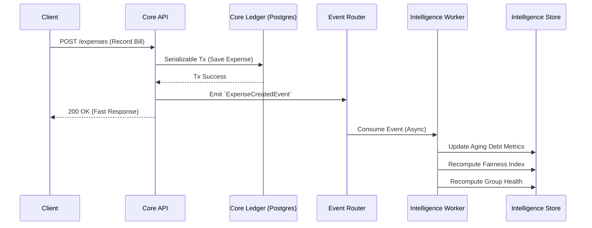

# 🧠 Financial Relationship Intelligence Engine
## Strategic Architecture Plan

**Document Status:** DRAFT  
**Target:** Next-Gen Smart Expense Platform (Social Financial Operating System)  
**Author:** Product Intelligence Architect  

---

> [!IMPORTANT]
> **SYSTEM SAFETY PREAMBLE**
> This architecture strictly adheres to the "Read-Only Intelligence" rule. The Intelligence Engine (IE) sits structurally above the Core Ledger. It is mathematically incapable of mutating balances, settlements, or core group states. It observes, derives, and advises, but never dictates financial truth.

---

## 1. High-Level System Architecture

The system transitions from a classic 3-tier CRUD monolith into a **Command Query Responsibility Segregation (CQRS) adjacent architecture** with an embedded event-driven analytics plane.

### Core Components:
1.  **Core Ledger (Existing)**: The source of absolute financial truth. Handles transactional mutations (Expenses, Settlements).
2.  **Event Router (New)**: A lightweight pub/sub mechanism hooking into the Core Ledger's successful transactions.
3.  **Intelligence Workers (New)**: Asynchronous background processors that consume events to calculate behaviors, velocities, and scores.
4.  **Intelligence Data Store (New)**: A parallel data persistence layer (read-models, materialized views, or Redis) optimized for analytical queries.
5.  **Intelligence API (New)**: A read-only GraphQL or REST API that serves insights to the frontend without touching the Core Ledger.

---

## 2. Data Flow Design

The intelligence layer operates asynchronously to ensure the Core Ledger's performance is never degraded by analytical computations.



---

## 3. Intelligence Computation Layer Design

Computations are divided into three processing paradigms:

1.  **Real-time / Event-Triggered (Stream)**
    *   *Trigger:* New settlement recorded.
    *   *Computation:* Instantly updates the user's "Time-to-Settle" average and adjusts the Trust Score.
2.  **Periodic / Scheduled (Batch)**
    *   *Trigger:* Nightly Cron Job.
    *   *Computation:* Calculates "Debt Aging". If a debt crosses 30 days, it penalizes the Trust Score and flags the debt as "Stale" in the Group Health metrics.
3.  **On-Demand / JIT (Query)**
    *   *Trigger:* User requests a highly specific contextual insight.
    *   *Computation:* Derived on the fly from pre-aggregated buckets to save storage.

---

## 4. Backend Service Design

The Intelligence Engine will be isolated in a new domain module: `src/modules/intelligence`.

*   **`IntelligenceService`**: The orchestrator. Exposes methods like `getUserTrustScore(userId)` or `getGroupHealth(groupId)`.
*   **`AnalyticsEngine`**: Contains the mathematical models for Fairness, Trust, and Aging.
*   **`EventHandlers`**: Subscribes to `ExpenseAdded`, `SettlementRecorded`, `MemberJoined` events.

> [!WARNING]
> **Dependency Rule:** The `intelligence` module may import `prisma` for READ-ONLY queries, but the `balance` and `settlement` modules MUST NEVER import anything from `intelligence`. Core does not depend on Intelligence.

---

## 5. Frontend Integration Strategy

The UI must treat Intelligence as an **enhancement, not a dependency**. If the Intelligence API fails, the app falls back to being a perfect, mathematically sound expense splitter.

*   **Graceful Degradation**: Intelligence components (e.g., `<TrustScoreBadge />`, `<InsightBanner />`) handle their own loading and error states without crashing parent layouts.
*   **Contextual Hydration**: The existing `Dashboard` and `BestStrategyCard` will fetch their intelligence payload in a separate, non-blocking network request (`useIntelligence(userId)`).
*   **Data Merging**: The frontend merges standard `EnrichedDebt` with `DebtInsight` to sort the "Smart Settlement" list by social priority rather than just monetary value.

---

## 6. Performance Strategy

*   **Zero-Impact Writes**: The Core Ledger API never waits for intelligence calculations to complete before returning `200 OK`.
*   **Pre-Aggregation**: Trust scores and group health metrics are pre-calculated and stored as simple integers/floats. The read API merely fetches a static row.
*   **Debouncing**: If a user uploads 50 expenses via a bulk tool, the event router debounces the "Group Health Recomputation" to run only once after a 5-second quiet period.

---

## 7. Caching Strategy

Given the read-heavy nature of analytical insights:

*   **Redis** will be introduced as the primary cache layer for Intelligence.
*   **Keys**: `intel:user:{id}:score`, `intel:group:{id}:health`.
*   **Invalidation**: The background Intelligence Workers invalidate specific cache keys when they finish processing an event that alters the underlying score.
*   **TTL**: Insights that are not highly time-sensitive (like "Contribution Asymmetry") have a TTL of 12-24 hours.

---

## 8. Future Scalability Strategy

As the "Social Financial Operating System" scales:
1.  **Extract the Engine**: Move the Intelligence Engine out of the Node.js monolith into a dedicated microservice (potentially in Go or Rust for numerical computing performance).
2.  **OLAP Database**: Transition from standard Postgres tables to an OLAP columnar database (e.g., ClickHouse) specifically for behavioral event streams.
3.  **Message Broker**: Upgrade the internal Node EventEmitter to Kafka or RabbitMQ for durable, replayable event sourcing.

---

## 9. Safety Boundary Enforcement

To absolutely guarantee the "Read-Only" invariant:

1.  **Database Level**: Create a separate database user (e.g., `smart_expense_intel`) that only has `GRANT SELECT` on `Expense`, `Settlement`, `User`, `Group`, but `GRANT ALL` on `Intel_*` tables.
2.  **Code Level (Static Analysis)**: Introduce an ESLint rule that bans the `intelligence` module from calling `prisma.expense.create`, `prisma.settlement.create`, `prisma.$executeRaw`, etc.
3.  **Architectural Level**: Intelligence API endpoints only support `GET` methods (no `POST`/`PUT`/`DELETE` for intelligence data from the client).

---

## 10. Recommended Database Extensions

New schema/tables explicitly for the Intelligence Engine:

```prisma
model Intel_UserBehavior {
  userId               String   @id
  trustScore           Float    // 0-100 scale
  avgTimeToSettleHours Int
  totalDelayedPayments Int
  lastCalculatedAt     DateTime
}

model Intel_GroupHealth {
  groupId              String   @id
  healthScore          Float    // 0-100 scale
  fairnessIndex        Float    // 0.0 (perfectly fair) to 1.0 (one person pays all)
  staleDebtVolume      Decimal  // Sum of debts older than 30 days
  lastCalculatedAt     DateTime
}

model Intel_DebtPriority {
  id                   String   @id @default(uuid())
  groupId              String
  debtorId             String
  creditorId           String
  socialPriorityScore  Float    // Used to reorder the BestStrategy suggestions
}
```

---

## 11. Recommended Analytics Models

1.  **Trust Score Model (The "Credit Score" for friends)**:
    *   Calculated via a decaying weighted average of Settlement Speed (Time between Debt Incurred and Debt Settled).
    *   Penalties for "Ghosting" (debts > 60 days).
    *   Rewards for consistent, full-amount settlements.
2.  **Contribution Fairness (Gini Coefficient)**:
    *   Measures who absorbs the initial out-of-pocket costs.
    *   If Alice always pays the restaurant bill and waits for reimbursements, her "Contribution Index" is high. The system will nudge others to pick up the next bill.
3.  **Contextual Prioritization (Smart Triage)**:
    *   Prioritize paying back people with high Trust Scores first.
    *   Prioritize debts that cross psychological thresholds (e.g., older than 30 days, or > $500).

---

## 12. UI/UX Evolution Strategy

**Phase 1: Ambient Awareness**
*   Add subtle badges to Group Cards: *“⚡ Fast Settling Group”* or *“🐢 Payments are running behind”*.
*   Add a "Reliability" badge next to user avatars in the `BestStrategyCard`.

**Phase 2: Active Nudging**
*   Instead of just showing mathematically largest debts, the "Smart Assistant" says: *"You owe Bob $50 from 2 months ago. Let's clear this stale debt first to improve your Trust Score."*
*   When adding an expense, suggest the payer: *"Alice has covered the last 3 bills. Maybe Bob should get this one?"*

**Phase 3: The Social Profile**
*   A new "My Financial Persona" page where users can see their Trust Score, average settlement time, and contribution badges (e.g., "The Banker", "Lightning Payer").

---

## 13. Event-Driven Intelligence Strategy

We will implement a rich **Domain Event Dictionary**:

*   `Financial.ExpenseAdded` -> Triggers recalculation of Group Fairness.
*   `Financial.SettlementRecorded` -> Triggers Time-To-Settle (TTS) computation and Trust Score update.
*   `Group.MemberJoined` -> Initializes baseline Trust/Health metrics.
*   `Time.DayElapsed` (Cron) -> Triggers Debt Aging calculations; degrades Group Health if debts rot.

---

## 14. Future AI-Coordinator Evolution Path

This Intelligence Engine is the foundational data set for a future **Agentic AI Coordinator**.

Because we have strictly quantified behavioral data, an LLM-based coordinator can eventually step in to mediate social friction:
*   *"Hi team, the Goa Trip has $400 in unresolved debts that are 45 days old. As your coordinator, I've drafted a proposed settlement plan that minimizes transfers. Shall I ping Bob and Charlie to approve it?"*
*   Predictive modeling: *"Based on your household's recurring behavior, the utility bill is usually added this week by Sarah. Should I remind her?"*

By building this derived, safe, analytical layer today, we provide the structured context an AI will need tomorrow to act as a truly empathetic financial mediator.
